<a name="top"></a>

<div align="center">



<br />

<a href="https://github.com/Hacking-Notes/jwt/stargazers"></a>
<a href="https://github.com/Hacking-Notes/jwt/network/members"></a>
<a href="https://github.com/Hacking-Notes/jwt/commits"></a>
<a href="LICENSE"></a>
<a href="https://hacking-notes.com"></a>

</div>

<br />

A powerful Chrome extension for security testing and manipulating JWT (JSON Web Tokens) in web applications. This tool enables security professionals and developers to test different attack vectors by modifying JWT tokens on the fly during security assessments and penetration testing.


## Features

- Real-time JWT token manipulation and testing
- On-the-fly token payload modification
- Common JWT attack vector testing
- Token signature validation bypass testing
- Token expiration manipulation
- Algorithm switching capabilities
- DevTools integration for advanced token analysis
- Cookie and localStorage token interception
- Clipboard support for easy token manipulation


## Security Testing Capabilities

- Test privilege escalation by modifying user roles and permissions
- Manipulate token claims to test authorization boundaries
- Bypass signature verification
- Test token expiration handling
- Modify algorithm headers (e.g., 'none' algorithm attacks)
- Inject custom claims for security testing
- Test token replay protection mechanisms


## Installation

1. Clone this repository or download the source code
2. Open Chrome and navigate to `chrome://extensions/`
3. Enable "Developer mode" in the top right corner
4. Click "Load unpacked" and select the extension directory


## Usage

1. Click the extension icon in your Chrome toolbar to access the popup interface
2. Open Chrome DevTools and find the JWT panel for advanced features
3. The extension will automatically detect and parse JWT tokens in Cookies


## Project Structure

```
├── manifest.json        # Extension configuration
├── devtools.html        # DevTools panel entry
├── panel.html           # Main DevTools panel UI
├── images/              # Extension icons
├── css/                 # Stylesheets
└── js/                  # JavaScript files
```


## Development

To modify or enhance the extension:
1. Make your changes to the source code
2. Reload the extension in `chrome://extensions/`
3. Test your changes


## Security Note

This extension is designed for development and testing purposes only. Be cautious when using it with sensitive JWT tokens in production environments.


## License

This project is open source and available under the MIT License.


## Contributing

Contributions are welcome! Please feel free to submit a Pull Request.


## 🧰 Hacking Notes Ecosystem

<div align="center">

🌐 &nbsp;**[hacking-notes.com](https://hacking-notes.com)** &nbsp;·&nbsp; ✍️ &nbsp;**[blog](https://hacking-notes.medium.com/)** &nbsp;·&nbsp; 💬 &nbsp;**[discord](https://discord.gg/r68ameNHrD)**

</div>

| | Resource | What you get |
| :-: | -------- | ------------ |
| 🗺 | **[Hacker-Roadmap](https://github.com/Hacking-Notes/Hacker-Roadmap)** | Structured paths from beginner to pro — hobbyist, bug bounty, certs & degree. |
| 🔴 | **[RedTeam Notes](https://github.com/Hacking-Notes/RedTeam)** | Offensive security notes: recon, exploitation, Windows & Linux. |
| 🔷 | **[BlueTeam Notes](https://github.com/Hacking-Notes/BlueTeam)** | Defensive security notes: forensics, malware, log & packet analysis. |
| 🧩 | **[Extensions](https://github.com/Hacking-Notes/Extensions)** | Curated Chrome extensions for ethical hacking & recon. |
| 🔖 | **[Bookmarks](https://github.com/Hacking-Notes/Bookmarks)** | Curated hacker bookmark collection, one import away. |


<div align="right"><a href="#top">⬆ back to top</a></div>
